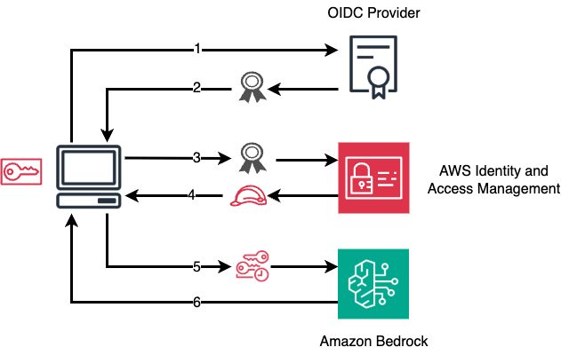

# Guidance for Claude Code with Amazon Bedrock

This guidance provides enterprise deployment patterns for Claude Code with Amazon Bedrock using existing identity providers. Integrates with your IdP (Okta, Azure AD, Auth0, Cognito User Pools) for centralized access control, audit trails, and usage monitoring across your organization.

## Key Features

### For Organizations

- **Enterprise IdP Integration**: Leverage existing OIDC identity providers (Okta, Azure AD, Auth0, etc.)
- **Centralized Access Control**: Manage Claude Code access through your identity provider
- **No API Key Management**: Eliminate the need to distribute or rotate long-lived credentials
- **Usage Monitoring**: Optional CloudWatch dashboards for tracking usage and costs
- **Multi-Region Support**: Configure which AWS regions users can access Bedrock in
- **Multi-Partition Support**: Deploy to AWS Commercial or AWS GovCloud (US) regions
- **Multi-Platform Support**: Windows, macOS (ARM & Intel), and Linux distributions

### For End Users

- **Seamless Authentication**: Log in with corporate credentials
- **Automatic Credential Refresh**: No manual token management required
- **AWS CLI/SDK Integration**: Works with any AWS tool or SDK
- **Multi-Profile Support**: Manage multiple authentication profiles
- **Cross-Platform**: Works on Windows, macOS, and Linux

## Table of Contents

1. [Quick Start](#quick-start)
2. [Architecture Overview](#architecture-overview)
3. [Prerequisites](#prerequisites)
4. [AWS Partition Support](#aws-partition-support)
5. [What Gets Deployed](#what-gets-deployed)
6. [Monitoring and Operations](#monitoring-and-operations)
7. [Per-User CloudWatch Monitoring with Application Inference Profiles](#per-user-cloudwatch-monitoring-with-application-inference-profiles)
8. [Additional Resources](#additional-resources)

## Quick Start

This guidance integrates Claude Code with your existing OIDC identity provider (Okta, Azure AD, Auth0, or Cognito User Pools) to provide federated access to Amazon Bedrock.

### What You Need

**Existing Identity Provider:**
You must have an active OIDC provider with the ability to create application registrations. The guidance federates this IdP with AWS IAM to issue temporary credentials for Bedrock access.

**AWS Environment:**

- AWS account with IAM and CloudFormation permissions
- Amazon Bedrock activated in target regions
- Python 3.10+ development environment for deployment

### What Gets Deployed

The deployment creates:

- IAM OIDC Provider or Cognito Identity Pool for federation
- IAM roles with scoped Bedrock access policies
- Platform-specific installation packages (Windows, macOS, Linux)
- Optional: OpenTelemetry monitoring infrastructure

**Deployment time:** 2-3 hours for initial setup including IdP configuration.

See [QUICK_START.md](QUICK_START.md) for complete step-by-step deployment instructions.

## Architecture Overview

This guidance uses Direct IAM OIDC federation as the recommended authentication pattern. This provides temporary AWS credentials with complete user attribution for audit trails and usage monitoring.

**Alternative:** Cognito Identity Pool is also supported for legacy IdP integrations. See [Deployment Guide](assets/docs/DEPLOYMENT.md) for comparison.

### Authentication Flow (Direct IAM Federation)



1. **User initiates authentication**: User requests access to Amazon Bedrock through Claude Code
2. **OIDC authentication**: User authenticates with their OIDC provider and receives an ID token
3. **Token submission to IAM**: Application sends the OIDC ID token to Amazon Cognito
4. **IAM returns credentials**: AWS IAM validates and returns temporary AWS credentials
5. **Access Amazon Bedrock**: Application uses the temporary credentials to call Amazon Bedrock
6. **Bedrock response**: Amazon Bedrock processes the request and returns the response

## Prerequisites

### For Deployment (IT Administrators)

**Software Requirements:**

- Python 3.10-3.13
- Poetry (dependency management)
- AWS CLI v2
- Git

**AWS Requirements:**

- AWS account with appropriate IAM permissions to create:
  - CloudFormation stacks
  - IAM OIDC Providers or Cognito Identity Pools
  - IAM roles and policies
  - (Optional) Amazon Elastic Container Service (Amazon ECS) tasks and Amazon CloudWatch dashboards
  - (Optional) Amazon Athena, AWS Glue, AWS Lambda, and Amazon Data Firehose resources
  - (Optional) AWS CodeBuild
- Amazon Bedrock activated in target regions

**OIDC Provider Requirements:**

- Existing OIDC identity provider (Okta, Azure AD, Auth0, etc.)
- Ability to create OIDC applications
- Redirect URI support for `http://localhost:8400/callback`

### For End Users

**Software Requirements:**

- AWS CLI v2 (for credential process integration)
- Claude Code installed
- Web browser for SSO authentication

**No AWS account required** - users authenticate through your organization's identity provider and receive temporary credentials automatically.

**No Python, Poetry, or Git required** - users receive pre-built installation packages from IT administrators.

### Supported AWS Regions

The guidance can be deployed in any AWS region that supports:

- IAM OIDC Providers or Amazon Cognito Identity Pools
- Amazon Bedrock
- (Optional) Amazon Elastic Container Service (Amazon ECS) tasks and Amazon CloudWatch dashboards
- (Optional) Amazon Athena, AWS Glue, AWS Lambda, and Amazon Data Firehose resources
- (Optional) AWS CodeBuild

Both AWS Commercial and AWS GovCloud (US) partitions are supported. See [AWS Partition Support](#aws-partition-support) for details.

### Cross-Region Inference

Claude Code uses Amazon Bedrock's cross-region inference for optimal performance and availability. During setup, you can:

- Select your preferred Claude model (Opus, Sonnet, Haiku)
- Choose a cross-region profile (US, Europe, APAC) for optimal regional routing
- Select a specific source region within your profile for model inference

This automatically routes requests across multiple AWS regions to ensure the best response times and highest availability. Modern Claude models (3.7+) require cross-region inference for access.

### Platform Support

The authentication tools support all major platforms:

| Platform | Architecture          | Build Method                | Installation |
| -------- | --------------------- | --------------------------- | ------------ |
| Windows  | x64                   | AWS CodeBuild (Nuitka)      | install.bat  |
| macOS    | ARM64 (Apple Silicon) | Native (PyInstaller)        | install.sh   |
| macOS    | Intel (x86_64)        | Cross-compile (PyInstaller) | install.sh   |
| macOS    | Universal (both)      | Universal2 (PyInstaller)    | install.sh   |
| Linux    | x86_64                | Docker (PyInstaller)        | install.sh   |
| Linux    | ARM64                 | Docker (PyInstaller)        | install.sh   |

**Build System:**

The package builder automatically creates executables for all platforms using PyInstaller (macOS/Linux) and AWS CodeBuild with Nuitka (Windows). All builds create standalone executables - no Python installation required for end users.

See [QUICK_START.md](QUICK_START.md#platform-builds) for detailed build configuration.

## AWS Partition Support

This guidance supports deployment across multiple AWS partitions with a single, unified codebase. The same CloudFormation templates and deployment process work seamlessly in both AWS Commercial and AWS GovCloud (US) regions.

### Supported Partitions

| Partition | Regions | Use Cases |
|-----------|---------|-----------|
| **AWS Commercial** (`aws`) | All regions where Bedrock is available | Standard commercial workloads |
| **AWS GovCloud (US)** (`aws-us-gov`) | us-gov-west-1, us-gov-east-1 | US government agencies, contractors, and regulated workloads |

### How It Works

The guidance automatically detects the AWS partition at deployment time and configures resources appropriately:

**Resource ARNs:**
- CloudFormation uses the `${AWS::Partition}` pseudo-parameter
- Automatically resolves to `aws` or `aws-us-gov`
- Example: `arn:${AWS::Partition}:bedrock:*::foundation-model/*`

**Service Principals:**
- Cognito Identity service principals are partition-specific
- Commercial: `cognito-identity.amazonaws.com`
- GovCloud West: `cognito-identity-us-gov.amazonaws.com`
- GovCloud East: `cognito-identity.us-gov-east-1.amazonaws.com`
- IAM role trust policies automatically use the correct principal based on region

**S3 Endpoints:**
- Commercial: `s3.region.amazonaws.com`
- GovCloud: `s3.region.amazonaws.com`

### Deploying to AWS GovCloud

Follow the same [Quick Start](#quick-start) instructions with your GovCloud credentials active. During `ccwb init`, select a GovCloud region (us-gov-west-1 or us-gov-east-1) and the wizard will automatically configure GovCloud-compatible models and endpoints.

**GovCloud-Specific Considerations:**

1. **Credentials:** GovCloud requires separate AWS credentials from commercial accounts
2. **Model IDs:** GovCloud uses region-prefixed model IDs (e.g., `us-gov.anthropic.*`)
3. **FIPS Endpoints:** Cognito hosted UI uses `{prefix}.auth-fips.{region}.amazoncognito.com`
4. **Managed Login:** Branding must be created for each Cognito app client

### Validation

After deployment, verify the correct partition configuration:

```bash
# Check IAM role ARN uses correct partition
aws iam get-role \
  --role-name BedrockCognitoFederatedRole \
  --region <region> \
  --query 'Role.Arn'

# Expected ARN formats:
# Commercial: arn:aws:iam::ACCOUNT:role/BedrockCognitoFederatedRole
# GovCloud: arn:aws-us-gov:iam::ACCOUNT:role/BedrockCognitoFederatedRole
```

### Backward Compatibility

✅ **All changes are fully backward compatible**

- Existing commercial deployments continue to work without modification
- CloudFormation updates can be applied to existing stacks
- No changes to user-facing functionality
- No data migration required

## What Gets Deployed

### Authentication Infrastructure

The `ccwb deploy` command creates:

**IAM Resources:**

- IAM OIDC Provider (for Direct IAM federation) or Cognito Identity Pool (for legacy IdP)
- IAM role with trust relationship for federated access
- IAM policies scoped to:
  - Bedrock model invocation in configured regions
  - CloudWatch metric publishing (if monitoring enabled)

**User Distribution Packages:**

- Platform-specific executables (Windows, macOS ARM64/Intel, Linux x64/ARM64)
- Installation scripts that configure AWS CLI credential process
- Pre-configured settings (OIDC provider, model selection, monitoring endpoints)

### Distribution Options (Optional)

After building packages, you can share them with users in three ways:

| Method                | Best For               | Authentication                 |
| --------------------- | ---------------------- | ------------------------------ |
| **Manual Sharing**    | Any size team          | None                           |
| **Presigned S3 URLs** | Automated distribution | None                           |
| **Landing Page**      | Self-service portal    | IdP (Okta/Azure/Auth0/Cognito) |

**Manual Sharing:** Zip the `dist/` folder and share via email or internal file sharing. No additional infrastructure required.

**Presigned URLs:** Generate time-limited S3 URLs for direct downloads. Automated but requires S3 bucket setup.

**Landing Page:** Self-service portal with IdP authentication, platform detection, and custom domain support. Full automation with compliance features.

See [Distribution Comparison](assets/docs/distribution/comparison.md) for detailed setup guides.

### Monitoring Infrastructure (Optional)

Enable usage visibility with OpenTelemetry monitoring stack:

**Components:**

- VPC and networking resources (or use existing VPC)
- ECS Fargate cluster running OpenTelemetry collector
- Application Load Balancer for metric ingestion
- CloudWatch dashboards with real-time usage metrics
- DynamoDB for metrics aggregation

**Optional Analytics Add-On:**

- Kinesis Data Firehose streaming metrics to S3
- S3 data lake for long-term storage
- Amazon Athena for SQL queries on historical data
- AWS Glue Data Catalog for schema management

See [QUICK_START.md](QUICK_START.md) for step-by-step deployment instructions.

## Monitoring and Operations

Optional OpenTelemetry monitoring provides comprehensive usage visibility for cost attribution, capacity planning, and productivity insights.

### Available Metrics

**Token Economics:**

- Input/output/cache token consumption by user, model, and type
- Prompt caching effectiveness (hit rates, token savings)
- Cost attribution by user, team, or department

**Code Activity:**

- Lines of code written vs accepted (productivity signal)
- File operations breakdown (edits, searches, reads)
- Programming language distribution

**Operational Health:**

- Active users and top consumers
- Usage patterns (hourly/daily heatmaps)
- Authentication and API error rates

### Infrastructure

The monitoring stack (deployed with `ccwb deploy monitoring`) includes:

- ECS Fargate running OpenTelemetry collector
- Application Load Balancer for metric ingestion
- CloudWatch dashboards for real-time visualization
- Optional: S3 data lake + Athena for historical analysis

See [Monitoring Guide](assets/docs/MONITORING.md) for setup details and dashboard examples.
See [Analytics Guide](assets/docs/ANALYTICS.md) for SQL queries on historical data.

## Per-User CloudWatch Monitoring with Application Inference Profiles

This deployment supports an alternative monitoring approach based on **Bedrock Application Inference Profiles** that provides server-side usage tracking with zero client-side configuration. Unlike the OpenTelemetry stack, metrics are generated directly by AWS Bedrock and are always available regardless of how the end user has configured their environment.

### Why Use This Approach

The OpenTelemetry monitoring stack collects metrics from the client side. If a user's machine does not send data (misconfiguration, network issue, outdated binary), their token consumption is invisible to cost managers — but the AWS bill is not. Application Inference Profiles solve this:

- **Metrics are written server-side by Bedrock** — no client configuration required
- **Four native CloudWatch metrics** per invocation: `InputTokenCount`, `OutputTokenCount`, `CacheReadInputTokenCount`, `CacheWriteInputTokenCount`
- **Full cost attribution** by user, cost center, department, and organization via resource tags
- **Hourly (and finer) cost controls** — metrics are available at 1-minute granularity
- **Per-user isolation** — each user can only invoke their own profiles (ABAC enforcement)

### How It Works

On each user's **first login**, the credential provider automatically:

1. Creates one Bedrock Application Inference Profile per enabled model, named `claude-code-{email-hash}-{model-key}`
2. Tags each profile with `user.email`, `cost_center`, `department`, `organization` (from the OIDC JWT claims)
3. Patches `~/.claude.json` with the ARN of the default model so Claude Code uses it immediately

From that point, every Claude Code invocation is tracked in CloudWatch under the `Bedrock` namespace with the user's tags, with no further setup needed.

### Default Models

Three models are pre-configured. To add or retire a model, update `INFERENCE_PROFILE_MODELS` in [source/claude_code_with_bedrock/models.py](source/claude_code_with_bedrock/models.py):

| Model Key | Model | Role |
|---|---|---|
| `sonnet-4-6` | Claude Sonnet 4.6 | **Default** — recommended for most workloads |
| `opus-4-6` | Claude Opus 4.6 | Most capable — complex reasoning |
| `haiku-4-5` | Claude Haiku 4.5 | Fastest and most cost-effective |

### Prerequisites

Before enabling this feature, ensure your deployment satisfies these requirements:

1. **Bedrock Application Inference Profiles quota** — the default limit is 2000 per account per region. With 3 models, this supports up to ~666 users before hitting the limit. Request an increase via [AWS Service Quotas](https://console.aws.amazon.com/servicequotas/) (`Amazon Bedrock > Application inference profiles per account`) if needed.

2. **OIDC JWT must include an `email` claim** — this is standard for Okta, Azure AD (Microsoft Entra), Auth0, and Cognito User Pools. Verify your OIDC application is configured to include it.

3. **Optional cost attribution claims** — the following custom claims are mapped to CloudWatch tags automatically if present in the JWT:

   | JWT Claim | CloudWatch Tag |
   |---|---|
   | `custom:cost_center` | `cost_center` |
   | `custom:department` | `department` |
   | `custom:organization` | `organization` |
   | `custom:team` | `team` |

### Deployment Steps

**Step 1 — Enable the feature in your ccwb profile**

Edit your profile configuration (`~/.ccwb/profiles/<profile-name>.json`) and set:

```json
{
  "inference_profiles_enabled": true,
  "inference_profiles_default_model": "sonnet-4-6"
}
```

Or set it during `ccwb init` when prompted.

**Step 2 — Re-deploy the Cognito Identity Pool stack**

The IAM policy on the Cognito authenticated role must be updated to grant users permission to create and invoke their own Application Inference Profiles:

```bash
poetry run ccwb deploy auth --profile <your-profile>
```

This updates the `cognito-identity-pool.yaml` stack with the new ABAC IAM statements. The update is non-destructive and takes approximately 2 minutes.

**Step 3 — Re-package and redistribute (if using distribution)**

If you use the landing page or presigned S3 distribution, rebuild and redistribute the package so end users receive the updated credential provider binary:

```bash
poetry run ccwb package --profile <your-profile>
# then: ccwb distribute ...
```

**Step 4 — Verify on first user login**

After the first login, check that profiles were created:

```bash
# As the end user:
ccwb profiles list
```

Expected output:

```
Your Bedrock Application Inference Profiles

  Model Key    Display Name          ARN                                                                      Default
  opus-4-6     Claude Opus 4.6       arn:aws:bedrock:eu-central-1:123456789:application-inference-profile/…
  sonnet-4-6   Claude Sonnet 4.6     arn:aws:bedrock:eu-central-1:123456789:application-inference-profile/…   ●
  haiku-4-5    Claude Haiku 4.5      arn:aws:bedrock:eu-central-1:123456789:application-inference-profile/…

Default model in ~/.claude.json: arn:aws:bedrock:eu-central-1:123456789:application-inference-profile/…
```

### Changing the Default Model

Users can switch their active model at any time without re-authenticating:

```bash
ccwb profiles set-default opus-4-6
```

This updates `~/.claude.json` immediately. The change takes effect on the next Claude Code command.

### CloudWatch Cost Monitoring

Once profiles are active, navigate to **CloudWatch → Metrics → Bedrock** in the AWS Console. Filter by the tag `user.email` to see per-user consumption broken down into all four token types.

To set up a cost alarm for a specific user or cost center:

```bash
aws cloudwatch put-metric-alarm \
  --alarm-name "bedrock-cost-alert-user" \
  --metric-name InputTokenCount \
  --namespace Bedrock \
  --dimensions Name=user.email,Value=user@example.com \
  --statistic Sum \
  --period 3600 \
  --threshold 1000000 \
  --comparison-operator GreaterThanThreshold \
  --evaluation-periods 1 \
  --alarm-actions arn:aws:sns:<region>:<account>:<topic>
```

### Adding a New Claude Model

When Anthropic releases a new model, add it to `INFERENCE_PROFILE_MODELS` in [source/claude_code_with_bedrock/models.py](source/claude_code_with_bedrock/models.py):

```python
INFERENCE_PROFILE_MODELS = {
    # ... existing models ...
    "new-model-key": {
        "source_model_arn": "arn:aws:bedrock:{region}::foundation-model/anthropic.claude-new-model-v1:0",
        "display_name": "Claude New Model",
        "description": "Description of the new model",
        "enabled": True,
    },
}
```

Re-deploy and re-package. On their next login, each user will automatically get a new Application Inference Profile for the new model.

To retire a model without deleting existing profiles, set `"enabled": False`. The model will no longer be created for new users and will be excluded from `ccwb profiles list`.

### Compatibility with the OpenTelemetry Stack

The two monitoring approaches can coexist during a transition period. You can enable Application Inference Profiles while keeping the OTEL stack running. Once all users have logged in and their profiles are confirmed via `ccwb profiles list`, you can decommission the OTEL collector stack to reduce costs:

```bash
poetry run ccwb destroy monitoring --profile <your-profile>
```

## Additional Resources

### Getting Started

- [Quick Start Guide](QUICK_START.md) - Step-by-step deployment walkthrough
- [CLI Reference](assets/docs/CLI_REFERENCE.md) - Complete command reference for the `ccwb` tool

### Architecture & Deployment

- [Architecture Guide](assets/docs/ARCHITECTURE.md) - System architecture and design decisions
- [Deployment Guide](assets/docs/DEPLOYMENT.md) - Advanced deployment options
- [Distribution Comparison](assets/docs/distribution/comparison.md) - Presigned URLs vs Landing Page
- [Local Testing Guide](assets/docs/LOCAL_TESTING.md) - Testing before deployment

### Monitoring & Analytics

- [Monitoring Guide](assets/docs/MONITORING.md) - OpenTelemetry setup and dashboards
- [Analytics Guide](assets/docs/ANALYTICS.md) - S3 data lake and Athena SQL queries

### Identity Provider Setup

- [Okta](assets/docs/providers/okta-setup.md)
- [Microsoft Entra ID (Azure AD)](assets/docs/providers/microsoft-entra-id-setup.md)
- [Auth0](assets/docs/providers/auth0-setup.md)

## License

This project is licensed under the MIT License - see the [LICENSE](LICENSE) file for details.
